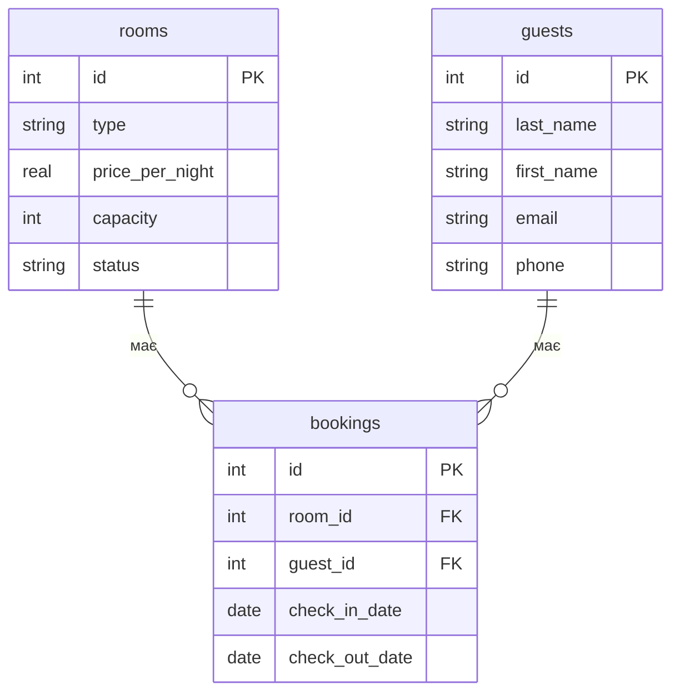

Завдання 2: 
Для rooms → bookings:
Один номер може мати багато бронювань у різний час, а кожне конкретне бронювання стосується одного номера. Тому зв'язок між rooms і bookings — 1:N.
Для guests → bookings:
Один гість може зробити багато бронювань у різний час, а кожне конкретне бронювання належить одному гостю. Тому зв'язок між guests і bookings — 1:N.

Завдання 3: 
rooms:
первинний ключ — id;
зовнішніх ключів немає.

guests:
первинний ключ — id;
зовнішніх ключів немає.

bookings:
первинний ключ — id;
room_id — зовнішній ключ, посилається на rooms.id;
guest_id — зовнішній ключ, посилається на guests.id.

Завдання 4:
Додатковою сутністю можна зробити room_types (типи номерів). Вона буде пов’язана з таблицею rooms зв’язком 1:N. Один тип номера може використовуватися для багатьох номерів, а кожен номер має один певний тип.

Завдання 5:
Схема готелю rooms → bookings ← guests подібна до прикладу services → orders ← clients. В обох випадках є дві основні сутності та проміжна сутність, яка містить зовнішні ключі для зв’язку між ними. Зв’язки між основними таблицями та проміжною таблицею мають тип 1:N. Таблиці rooms і guests, як і services і clients, не мають прямого зв’язку між собою, а пов’язані через таблицю bookings.

Контрольні питання
1) Концептуальна модель показує предметну область загалом: які є сутності та як вони пов'язані. Логічна модель уже описує таблиці, стовпці, ключі та зв'язки між ними, але ще не прив'язана до конкретної СУБД. Фізична модель показує, як ця структура реально буде реалізована в конкретній СУБД: конкретні типи даних, обмеження, індекси тощо.
2) Тому що при M:N один запис першої таблиці може бути пов'язаний з багатьма записами другої, і навпаки. Один зовнішній ключ може зберігати лише одне значення для одного запису. Тому створюють окрему проміжну таблицю, де кожен рядок зберігає одну пару пов'язаних записів.
3) || означає «рівно один», o{ — «нуль або багато», а |{ — «один або багато». Тому A ||--o{ B читається як: «один A пов'язаний з нулем або багатьма B», тобто зв'язок 1:N.